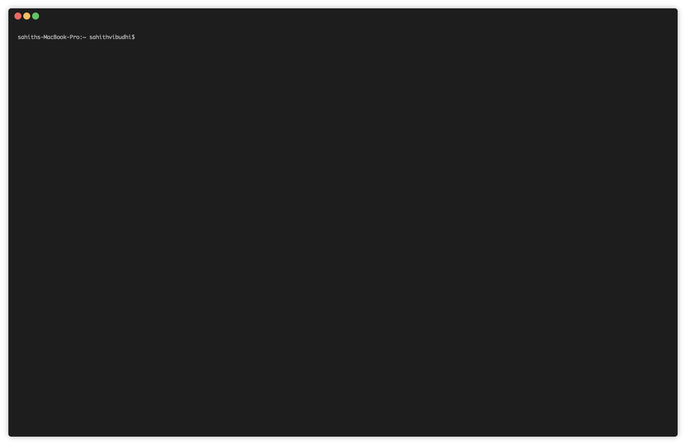

# gratis
An open-source, easy-to-customize back-end service right out of the box. Write your front-end let gratis handle the Back-end. ⚡



1. [Quick Start](#-quick-start)
2. [ How to Use?](#-how-to-use)
3. [How to Setup Project in your local environment?](#-how-to-setup-project-in-your-local-environment)

# 🚀 Quick Start

1. Install Gratis

```
npm install -g gratis-server
```

2. Start server

```
gratis-server --port 9000 --dburl mongodb://localhost:32770 --log true
```

That's it 💁‍♂️

# 📖 How to Use?

__To Insert Records:__

```
curl --header "Content-Type: application/json" \
  --request POST \
  --data '{"name":"t-series","subscribers":"78,000,000", "region":"asia"}' \
  http://localhost:3000/youtube/channels
```

---

__To Fetch Records:__

```
curl --request GET \
  http://localhost:3000/youtube/channels
# returns max 20 records
```

Querying data
```
curl --request GET \
  http://localhost:3000/youtube/channels?region=asia&sort=-subscribers&limit=5
```

---

__To Update Records:__
```
curl --header "Content-Type: application/json" \
  --request POST \
  --data '{"name":"t-series","subscribers":"79,000,000", "region":"asia"}' \
  http://localhost:3000/youtube/channels?name=t-series
```

---

__To Delete Recrods:__
```
curl --request DELETE \
  http://localhost:3000/youtube/channels?name=t-series
```

---

## How to Setup Project in your local environment?
```
git clone https://github.com/sahithvibudhi/gratis.git
cd gratis

npm install
npm start

# or

docker-compose up
```

> NOTE: Gratis needs a MongoDB server to store the data 💾.

To run it on a specific port. use:
```
node index.js --port 9000
```

To pass the database connection URL. use:
```
node index.js --port 9000 --dburl mongodb://localhost:32770 
```

To enable logging, use:
```
node index.js --port 9000 --dburl mongodb://localhost:32770 --log true
```

Gratis comes with a GUI to create new apps, to enable, use:
```
node index.js --dburl mongodb://localhost:32770 --log true --dashboard true
```

# TODO:
- Adapter to use different Data Stores
- Adapter to use different loggers
- Make auth Optional

---

<center> Built with ❤️ for front-end Developers </center>